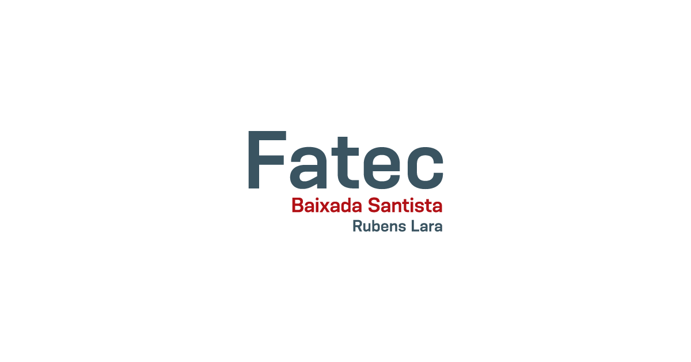

# Fatec Rubens Lara
Repositório central que abriga todas as atividades feitas durante o curso de Análise e Desenvolvimento de Sistemas

## Índice
### IAL-002: Algoritmos e lógica de programação
#### Objetivo:
Iniciar a formação em programação de computadores por meio de uma linguagem facilitadora do aprendizado de algoritmos, preferencialmente alguma uma linguagem de amplo emprego no mercado

#### Ementa:
Conceitos básicos sobre algoritmos e métodos para sua construção. Tipos de dados e variáveis. Álgebra booleana. Estruturas fundamentais de programas: sequencial, condicional e com repetição. Funções. Variáveis compostas homogêneas: vetores e matrizes.

### ILP-010: Linguagem de Programação
#### Objetivo:
Solucionar problemas utilizando a lógica de programação e a implementação de programas por meio de uma linguagem de programação.

#### Ementa:
Variáveis, constantes, operadores e expressões. Comando de desvio. Controle de malhas. Vetores e ponteiros. Funções de biblioteca. Estruturas, uniões e tipos definidos pelo usuário. Manipulação de arquivos.

### IED-001: Estrutura de dados
#### Objetivo:
Aprofundar conhecimentos sobre criação e manipulação de tipos abstratos de dados: listas, pilhas, filas e árvores.

#### Ementa:
Revisão dos conceitos básicos de tipos abstratos de dados. Pilhas, filas, alocação dinâmica, recursividade, listas encadeadas, tabelas de espalhamento e árvores. Aplicações das estruturas de dados em problemas computacionais.

### ILP-007: Programação Orientada a Objetos
#### Objetivo:
Implementar de softwares com o uso de uma linguagem de programação orientada a objetos.

#### Ementa:
Conceitos e evolução da tecnologia de orientação a objetos. Limitações e diferenças entre o paradigma da programação estruturada em relação à orientação a objetos. Conceito de objeto, classe, métodos, atributos, herança, polimorfismo, agregação, associação, dependência, encapsulamento, mensagem e suas respectivas notações na linguagem padrão de representação da orientação a objetos. Implementação de algoritmos orientados a objetos utilizando linguagens de programação. Aplicação e uso das estruturas fundamentais da orientação a objetos.

### IES-300: Engenharia de Software III
#### Objetivo:
Conhecer e aplicar padrões ao processo de software. Mapear modelos de representação.

#### Ementa:
Conceitos, evolução e importância de arquitetura de software. Padrões de Arquitetura. Padrões de Distribuição. Camadas no desenvolvimento de software. Tipos de Arquitetura de Software. Visões na arquitetura de software. Modelo de Análise e Projetos. Formas de representação. O processo de desenvolvimento. Mapeamento para implementação. Integração do sistema. Testes: planejamento e tipos. Manutenção. Documentação.